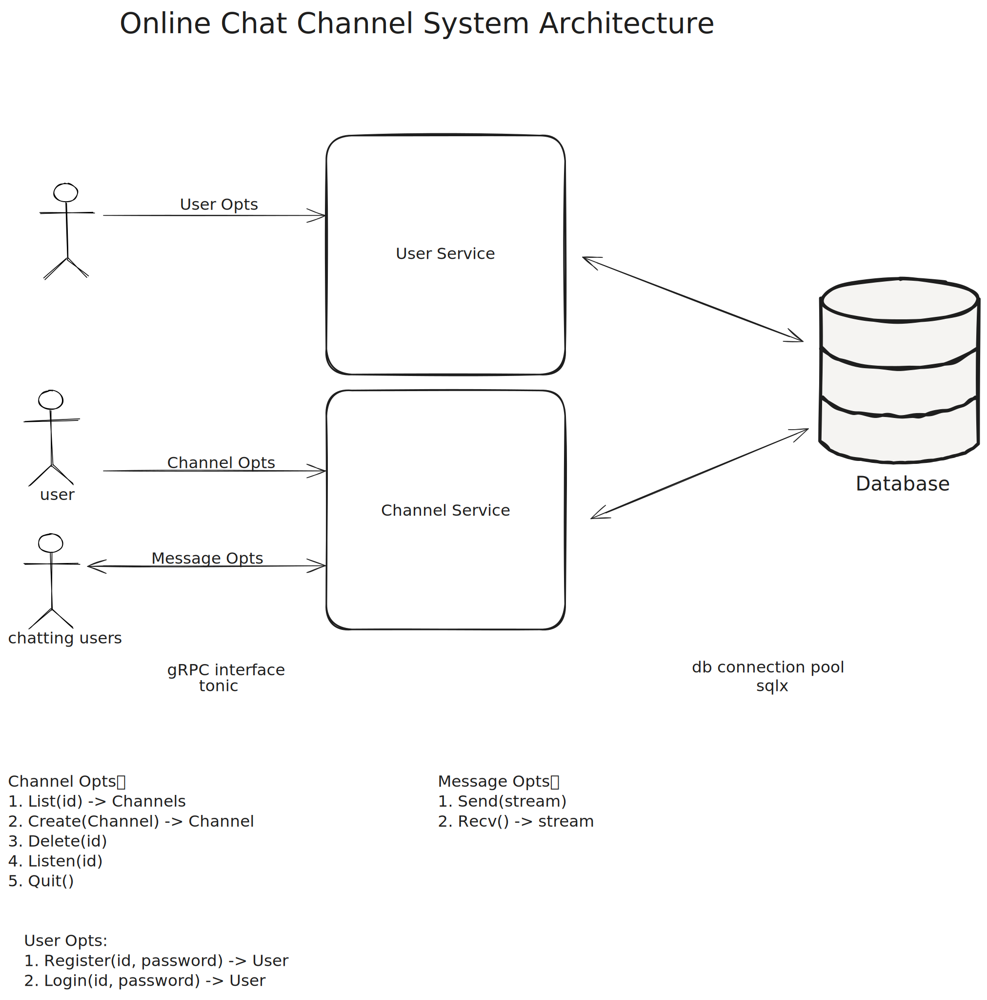
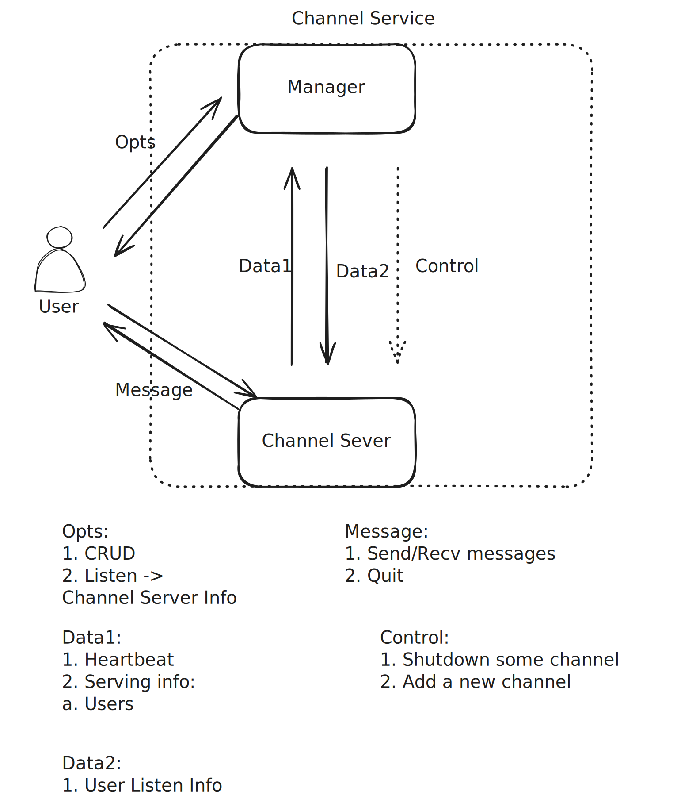

- Feature Name: (`core-service`)
- Start Date: (2025-01-17)

# Summary
[summary]: #summary

A core chat channel service that supports users to chat in a channel.

# Motivation
[motivation]: #motivation

We often need a real-time chat room when playing video games, I want to use this as my start-up rusty project.
It is execellent to support my friends to chat by my service.

# Guide-level explanation
[guide-level-explanation]: #guide-level-explanation

Basic architecture


# Reference-level explanation
[reference-level-explanation]: #reference-level-explanation
For now, we only consider to implement the service on single machine.
Because it is too difficult to consider distributed services from the beginning. Maybe they are to be discussed and designed in the future.

Here are our protobuf definition:
```proto

// For Channel Manager
service ChannelService {
  // For users
  // List specific or all channels depending on channel's id, and only id will be useful
  rpc List(Channel) returns (stream Channel);
  // Create a Channel, then the user will be owner
  rpc Create(Channel) returns (Channel);
  // Delete some Channel which only contains id, the executor must be its owner or admin
  rpc Delete(Channel) returns (google.protobuf.Empty);
  // Listen or Join some channel which only contains id
  rpc Listen (Channel) returns (ListenResponse);

  // For channel servers
  // Report something periodically
  rpc Report(ReportRequest) returns (google.protobuf.Empty);
}

// For specific channel server
service ChatService {
  // For users
  // Connect by websocket, user can send and recv message, disconnect means quit
  rpc Connect(stream Message) returns (stream Message);

  // For manager
  // Channel's users must be empty
  rpc Add(Channel) returns (google.protobuf.Empty);
  // Only id, check: there must be no user in channel
  rpc Remove(Channel) returns (google.protobuf.Empty);
}

// Service about User Opts
service UserService {
  rpc Register(RegisterRequest) returns (google.protobuf.Empty);
  rpc Login(LoginRequest) returns (LoginResponse);
}

message User {
  string id = 1;
  string name = 2;
}

// TBD
enum ChannelStatus {
    UNKNOWN = 0;
    IDLE = 1;
    SERVING = 2;
}

message Channel {
  uint32 id = 1;
  string name = 2;
  repeated User users = 3;
  uint32 limit = 4; // limit the num of users

}

message ListResponse {
  repeated Channel channels = 1;
}

message ChannelServer {
  string id = 1;
  string addr = 2;
  string name = 3;
  repeated Channel channels = 4;
}

message ListenResponse {
    ChannelServer server = 1; // server.channels = []
}

message ReportRequest {
  Metric metric = 1;
  // channels being served
  repeated Channel channels = 2;
}

// Metric like a heartbeat
message Metric {
  map<string, string> kv = 1;
}

message RegisterRequest {
  string user_id = 1;
  string password = 2;
  string name = 3;
}

message LoginRequest {
  string user_id = 1;
  string password = 2;
}

message LoginResponse {
  string token = 1;
}

message Message {
  uint32 user_id = 1;
  uint64 timestamp = 2;
  bytes data = 3;
}
```


We use postgres as the database.

The information of channels and users will be persistently stored in the database, but the interactions between users and channels will not be saved.

Below is the schema
```sql
CREATE SCHEMA chat;

CREATE TABLE chat.users (
    id VARCHAR(64) PRIMARY KEY, -- 使用 SERIAL 自动生成唯一整数 ID
    name VARCHAR(64) NOT NULL, -- 用户名，最大长度 64
    password_hash VARCHAR(255) NOT NULL -- 存储密码的哈希值
);

CREATE TABLE chat.channel {
    id SERIAL PRIMARY KEY,
    name VARCHAR(64) NOT NULL,
    limit INT NOT NULL,
    owner_id INT NOT NULL,
    FOREIGN KEY (owner_id) REFERENCES chat.users(id),
    CONSTRAINT check_limit CHECK (limit_num > 0 and limit_num <= 25)
};


// todo: administer of channel

// todo: history text message of channel

```

## User-Channel Constraint

After implementing shutdown connection signal, a user taking the old token from last `listen` request can connect to last chat server again. Here are two solving methods:
   1. using a redis to record expired tokens.
   2. **add a field `timestamp` in claims, and time of auth must be close to that.**

Use the second method.

There is a problem: a user may `listen` to different servers in a short time and `conn` to different chat-servers. In a distributed system, we cannot guarantee that "a user must be in a channel in same time". So use a limiter in `listen` to avoid that.


# Drawbacks
[drawbacks]: #drawbacks
1. For now, we concentrate on core logic, so register/login we just store id and password to db.
2. We donot think how to play audio in extreme cases.
# Rationale and alternatives
[rationale-and-alternatives]: #rationale-and-alternatives


# Prior art
[prior-art]: #prior-art


# Unresolved questions
[unresolved-questions]: #unresolved-questions


# Future possibilities
[future-possibilities]: #future-possibilities
