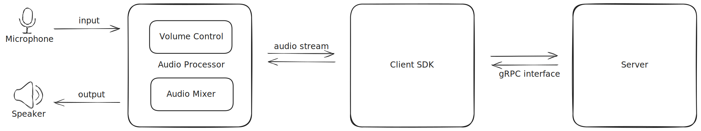

- Feature Name: (`audio-client`)
- Start Date: (2025-02-6)

# Summary
[summary]: #summary
An audio client SDK to support user to say and listen to some channel.

# Motivation
[motivation]: #motivation
After implementing basic service, a audio client SDK is needed for CMD/UI

# Guide-level explanation
[guide-level-explanation]: #guide-level-explanation

Basic architecture
Use [cpal](https://docs.rs/cpal/latest/cpal/) as a kit to sample/play audio data.

Here are some questions to be considered:
1. Is the `data`[u8] field in `Message` enough to describe the audio data?
2. How to play audio in extreme cases (delay, backlog, )
3. Pre-processing audio data in service side?

# Reference-level explanation
[reference-level-explanation]: #reference-level-explanation

# Drawbacks
[drawbacks]: #drawbacks

# Rationale and alternatives
[rationale-and-alternatives]: #rationale-and-alternatives

# Prior art
[prior-art]: #prior-art

# Unresolved questions
[unresolved-questions]: #unresolved-questions
# Future possibilities
[future-possibilities]: #future-possibilities
